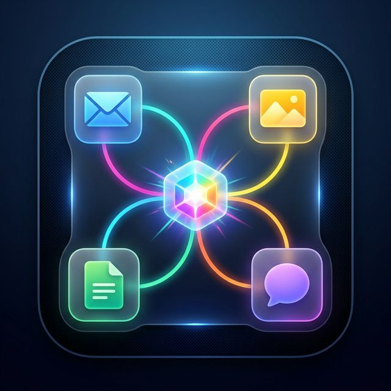
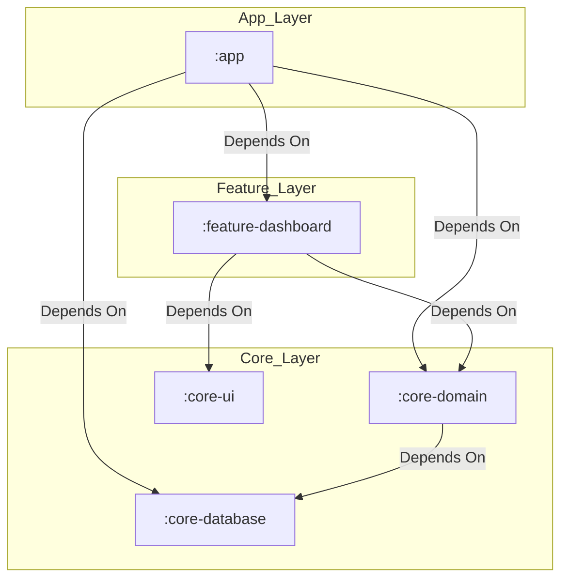

#  Multi App Share


**Multi App Share** is a utility Android application designed to streamline the process of sharing content across multiple applications. Instead of manually sharing a photo, video, link, or text to each social media platform or messaging app one by one, you can create custom groups and share to all of them in a sequential, guided workflow.

## 🚀 Features

- **Smart Auto-Grouping**: Group your apps automatically by system categories (Games, Maps, Productivity) with name-based fallbacks for strict isolation (Messaging, Email, Contacts).
- **Overlaid Translucent UX Control**: Sharing from an external app feels native; a floating layout guides custom choices without locking down standard focus pipelines.
- **Frosted Glass FX Visuals**: Overlaid sheets now feature rich translucent background blurring values securely retaining standard layout visual focuses safely.
- **Sequential Guided Workflow**: Guides you step-by-step through dispatching intents iteratively to apps in a group seamlessly.
- **Micro-Interaction Tactics**: Smooth sequential advancing tracking accurate tactile vibrational haptic feedback increments satisfying tactile layouts speeds.
- **Native Canvas Success Bursts**: Expanding Canvas bursts layer with revealing checkmarks confirming flawless sequence triggers layout completions accurately.
- **Optimized Async App Icon Speeds**: Sub-second deterministic background placeholders loading speeds populated instantly avoiding blank flashing frame updates.
- **Dynamic MIME Compatible Filters**: Hides whole columns entirely from display templates if **none** of their inner apps support the currently dispatched payload standard.
- **Frequency-Based Dashboard Sorting**: Automatically prioritizes highly-frequented apps and groups at the top for faster access.
- **Unified Multi-Format Support**: Seamlessly accommodates mixed content types like Images, Videos, Links, and Text bundles.
- **Precise Ranking Controls**: Quickly adjust group application order using intuitive Up/Down icons avoiding press-drag conflicts.
- **History Logs & Metrics Tracking**: Records backgrounds outputs timestamped so share rates and node overflows remain traceable easily.
- **Persistent expand-collapse saves layout defaults**: Remembers drawer layouts so overlay sheet sizes don't overflow crowded screens.
- **JSON Backup & Restore**: Easily Export or Import your custom groups list to JSON to transfer setups between devices securely.
- **Home Screen Shortcuts**: Pin highly frequented group bundles directly to your launcher desktop using safe Compat shortcut integrations.

## 🛠 Tech Stack

- **Language**: [Kotlin](https://kotlinlang.org/)
- **UI Framework**: [Jetpack Compose](https://developer.android.com/jetpack/compose)
- **Architecture**: MVVM with UseCase nodes
- **Dependency Injection**: [Dagger Hilt](https://dagger.dev/hilt/)
- **Concurrency**: Kotlin Coroutines & Flow
- **Data Persistence**: DataStore (Preferences) & Serialization (JSON)
- **Image Loading**: [Coil](https://coil-kt.github.io/coil/)
- **Design System**: Material 3 (Dynamic Color)

## 🏗 Module Architecture

The application follows a modular Clean Architecture pattern to enforce separation of concerns and build health.



### 🔒 Strict Visibility & Encapsulation
To enforce layout encapsulation and prevent leakage, candidate node sets consume `internal` modifier layouts:

| Module | Core Logic (Internal) | External API (Public) |
| :--- | :--- | :--- |
| **`:app`** | App triggers, Hilt modules glue | Application |
| **`:feature-dashboard`** | VM Screen logic bundles | Composables screens |
| **`:core-domain`** | RepositoryImpl bounds | UseCases & Repo Interfaces |
| **`:core-database`** | `AppDatabase`, `DatabaseModule` | Entity schemas & DAO interfaces |
| **`:core-ui`** | Themes & generic styles | Layout resource styles |

---

### 📂 Modules
- **`:app`**: Main Android Binary, Application triggers, and Hilt glue modules.
- **`:feature-dashboard`**: Encapsulates dashboard screens and Compose ViewModel setups.
- **`:core-domain`**: UseCases and Generic Repository interfaces.
- **`:core-database`**: Room persistence layers and Entity types.
- **`:core-ui`**: Centralized XML layout resources, Base themes, and icons.

---

## 🛡 FOSS & Privacy

This application is built with **Privacy-by-Design** and contains **NO Analytics, NO Trackers, and NO Proprietary SDKs** (e.g., GMS/Firebase). 

- **100% Free and Open-Source** under the [MIT License](LICENSE).
- **F-Droid Readiness**: Fastlane metadata inclusive of reproducible building recipes included.

---

## 📦 Installation & Setup

### 📥 Download the APK (Recommended)
You can download the latest pre-built version of the app directly from the [Releases](https://github.com/edwardlthompson/MultiAppShare/releases) page. 

1. Download the `app-debug.apk` (or `app-release.apk`) to your Android device.
2. Open the file to install.
3. If prompted, allow "Install from unknown sources" in your device settings.

### 💻 Build from Source (Advanced)
If you prefer to build that app yourself from scratch:
1. Clone the repository:
   ```bash
   git clone https://github.com/edwardlthompson/MultiAppShare.git
   ```
2. Ensure you have **JDK 21** toolchains and **Android Studio Ladybug+** installed.
3. Open the workspace; Gradle automatically synchronizes parameters mapping or version catalog.
4. To test modular components: Run `./gradlew test` securely layout triggers down downstream!

## 📖 How to Use

1. **Configure**: Select **"Autofill Groups"** on onboarding to automatically generate isolated categorical folders triggers setup down downstream.
2. **Share**: Inside simple exterior payloads (Photos, chrome, links), trigger default Android share dialogs and pick **Multi App Share** sheets.
3. **Automate**: Pick the target group; The first app in the custom list will open. On finish, return via Recent Apps to see the workflow iterate securely down downstream!

💡 **Pro-Tip**: The **Translucent Overlaid UX** controller lets you guide choices natively without locking standard focus pipelines layout completely securely down downstream!

## 🤝 Contributing

Contributions are welcome! Please read our [CONTRIBUTING.md](CONTRIBUTING.md) for details on our architectural layout standards, visual restrictions, and FOSS compliance parameters triggers setup down downstream.

## 🤝 Support the Developer

If you find this tool useful, consider supporting the development!

- **Telegram**: [@EdwardLeeThompson](https://t.me/EdwardLeeThompson)
- **Donate**: [Venmo](https://venmo.com/code?user_id=1857304970395648420)

## 📄 License

This project is licensed under the MIT License - see the [LICENSE](LICENSE) file for details.
