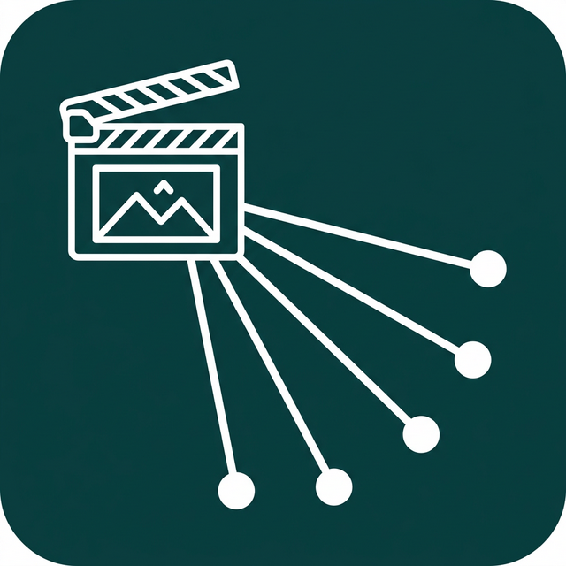

#  Multi App Share

**Multi App Share** is a utility Android application designed to streamline the process of sharing content across multiple applications. Instead of manually sharing a photo, video, link, or text to each social media platform or messaging app one by one, you can create custom groups and share to all of them in a sequential, guided workflow.

## 🚀 Features

- **Smart Auto-Grouping**: Group your apps automatically by system categories (Games, Maps, Productivity) with name-based fallbacks for strict isolation (Messaging, Email, Contacts).
- **Overlaid Translucent UX Control**: Sharing from an external app feels native; a floating sheet guides custom choices without locking down standard focus pipelines.
- **Dynamic MIME Compatible Filters**: Hides whole columns entirely from display templates if **none** of their inner apps support the currently dispatched payload standard.
- **Frequency-Based Dashboard Sorting**: Automatically prioritizes highly-frequented apps and groups at the top for faster access.
- **Sequential Guided Workflow**: Guides you smoothly step-by-step through dispatching intents iteratively to all apps in a group.
- **Unified Multi-Format Support**: Seamlessly accommodates mixed content types like Images, Videos, Links, and Text bundles.
- **Precise Ranking Controls**: Quickly adjust group application order using intuitive Up/Down icons avoiding press-drag conflicts.
- **History Logs & Metrics Tracking**: Records backgrounds outputs timestamped so share rates and node overflows remain traceable easily.
- **Persistent expand-collapse saves layout defaults**: Remembers drawer layouts so overlay sheet sizes don't overflow crowded screens.
- **JSON Backup & Restore**: Easily Export or Import your custom groups list to JSON to transfer setups between devices securely.
- **Home Screen Shortcuts**: Pin highly frequented group bundles directly to your launcher desktop using safe Compat shortcut integrations.

## 🛠 Tech Stack

- **Language**: [Kotlin](https://kotlinlang.org/)
- **UI Framework**: [Jetpack Compose](https://developer.android.com/jetpack/compose)
- **Architecture**: MVVM with UseCase nodes
- **Dependency Injection**: [Dagger Hilt](https://dagger.dev/hilt/)
- **Concurrency**: Kotlin Coroutines & Flow
- **Data Persistence**: DataStore (Preferences) & Serialization (JSON)
- **Image Loading**: [Coil](https://coil-kt.github.io/coil/)
- **Design System**: Material 3 (Dynamic Color)

## 📦 Installation & Setup

### 📥 Download the APK (Recommended)
You can download the latest pre-built version of the app directly from the [Releases](https://github.com/edwardlthompson/MultiAppShare/releases) page. 

1. Download the `app-debug.apk` (or `app-release.apk`) to your Android device.
2. Open the file to install.
3. If prompted, allow "Install from unknown sources" in your device settings.

### 💻 Build from Source (Optional)
If you prefer to build the app yourself:
1. Clone the repository:
   ```bash
   git clone https://github.com/edwardlthompson/MultiAppShare.git
   ```
2. Open the project in [Android Studio Ladybug](https://developer.android.com/studio) or newer.
3. Build and run the app on your device.

## 📖 How to Use

1. **Smart Onboarding Setup**: On first launch, select **"Autofill Groups"** to instantly generate isolated categorical folders (Social Media, Video, Games, etc.) fully automatically.
2. **Auto Group Button Control Details set**: You can also use the Dashboard FAB to trigger append sweeps on newer item installs recursively avoiding manual setups.
3. **Manual Override modifications set**: Open group context menus (three overflow dots) selecting "Modify Apps" to tweak selection layouts from grouped shortcut headers directly anchored top arrays.
4. **Ranking sort edits setups**: Reorder position limits seamlessly using Up/Down icons inside items avoiding coordinate conflicts.
5. **Guided Single-Item Sequential flow loop set**:
   - Open standard external apps holding payload targets (Photos, Chrome, etc).
   - Trigger default **Share Dialogs** (supports MIXED BUCKET multicopies).
   - Select **Multi App Share** overlays sheets cleanly.
   - Choose the target group from the floating translucent bottom sheet.
   - The first app in the group will securely open. Once you finish posting, simply return to your recent apps to see Multi App Share automatically proceed with the remaining apps on your group list!

## 🤝 Support the Developer

If you find this tool useful, consider supporting the development!

- **Telegram**: [@EdwardLeeThompson](https://t.me/EdwardLeeThompson)
- **Donate**: [Venmo](https://venmo.com/code?user_id=1857304970395648420)

## 📄 License

This project is licensed under the MIT License - see the [LICENSE](LICENSE) file for details.
