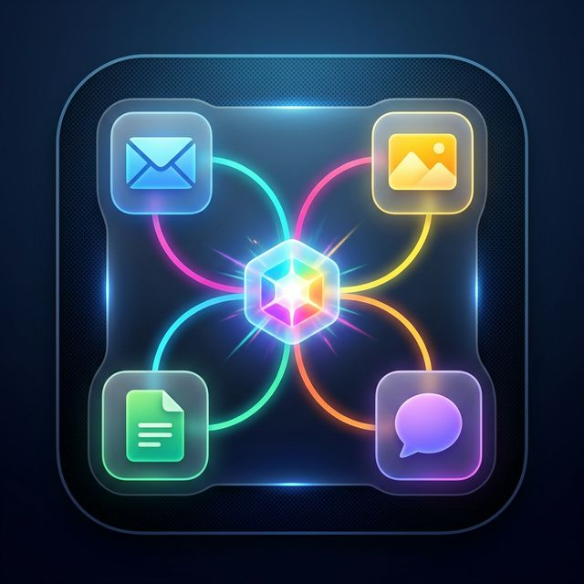
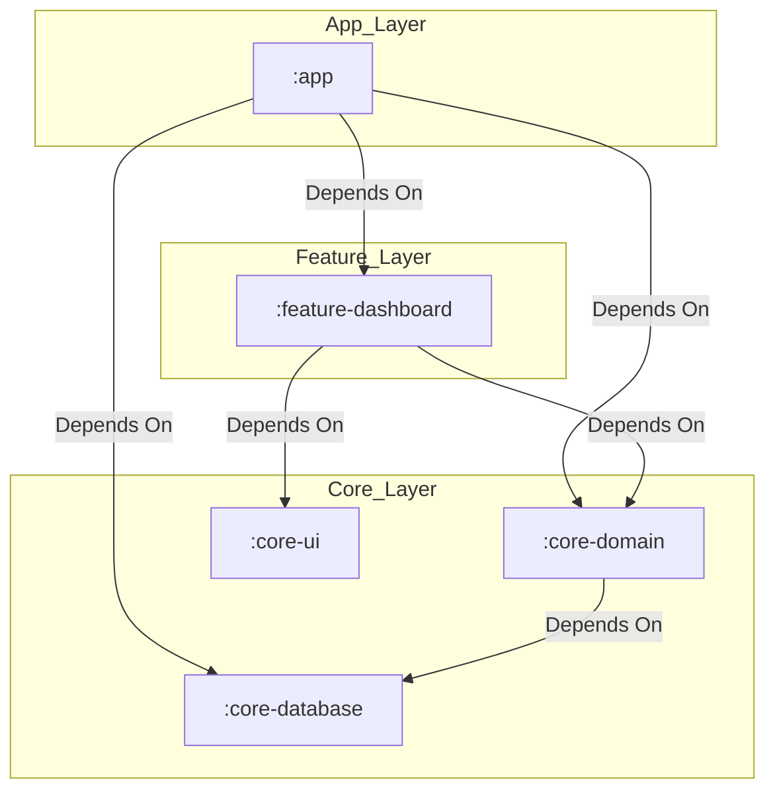

#  Multi App Share


**Multi App Share** is a utility Android application designed to streamline the process of sharing content across multiple applications. Instead of manually sharing a photo, video, link, or text to each social media platform or messaging app one by one, you can create custom groups and share to all of them in a sequential, guided workflow.

## 🚀 Features

- **Smart Auto-Grouping**: Group your apps automatically by system categories (Games, Maps, Productivity) with name-based fallbacks for strict isolation (Messaging, Email, Contacts).
- **Overlaid Translucent UX Control**: Sharing from an external app feels native; a floating layout guides custom choices without locking down standard focus pipelines.
- **Frosted Glass FX Visuals**: Overlaid sheets now feature rich translucent background blurring values securely retaining standard layout visual focuses safely.
- **Sequential Guided Workflow**: Guides you step-by-step through dispatching intents iteratively to apps in a group seamlessly; progress stays in the notification shade at low priority so target apps (e.g. social composers) are not covered by pop-up banners.
- **Micro-Interaction Tactics**: Smooth sequential advancing tracking accurate tactile vibrational haptic feedback increments satisfying tactile layouts speeds.
- **Native Canvas Success Bursts**: Expanding Canvas bursts layer with revealing checkmarks confirming flawless sequence triggers layout completions accurately.
- **Optimized Async App Icon Speeds**: Sub-second deterministic background placeholders loading speeds populated instantly avoiding blank flashing frame updates.
- **Dynamic MIME Compatible Filters**: Hides whole columns entirely from display templates if **none** of their inner apps support the currently dispatched payload standard.
- **Frequency-Based Dashboard Sorting**: Automatically prioritizes highly-frequented apps and groups at the top for faster access.
- **Unified Multi-Format Support**: Seamlessly accommodates mixed content types like Images, Videos, Links, and Text bundles.
- **Precise Ranking Controls**: Quickly adjust group application order using intuitive Up/Down icons avoiding press-drag conflicts.
- **History Logs & Metrics Tracking**: Records backgrounds outputs timestamped so share rates and node overflows remain traceable easily.
- **Persistent expand-collapse saves layout defaults**: Remembers drawer layouts so overlay sheet sizes don't overflow crowded screens.
- **Encrypted JSON Backup & Restore**: Export or import your custom groups with AES-256-GCM passphrase encryption; import guarded against oversized files.
- **Reliable group persistence**: Delete, import, and reorder operations sync correctly to Room storage.
- **Duplicate-safe group names**: Trimmed names are validated so you cannot create two groups with the same label.
- **Share session resilience**: Sequential share state survives screen rotation; new share intents reset stale sessions; failed targets are skipped automatically.
- **Deeplink group expand**: Cold launch `multiappshare://group?name=YourGroup` opens and expands the matching group.
- **Home Screen Shortcuts**: Pin highly frequented group bundles directly to your launcher desktop using safe Compat shortcut integrations.

## 🛠 Tech Stack

- **Language**: [Kotlin 2.4.0](https://kotlinlang.org/)
- **Build System**: [Gradle 9.5](https://gradle.org/) with [AGP 9.2.1](https://developer.android.com/studio/releases/gradle-plugin)
- **UI Framework**: [Jetpack Compose](https://developer.android.com/jetpack/compose) (BOM 2026.05.01)
- **Architecture**: MVVM with UseCase nodes
- **Dependency Injection**: [Dagger Hilt 2.59](https://dagger.dev/hilt/)
- **Concurrency**: Kotlin Coroutines & Flow
- **Data Persistence**: Room 2.8 & DataStore (Preferences)
- **Image Loading**: [Coil](https://coil-kt.github.io/coil/)
- **Design System**: Material 3 (Dynamic Color)

## 🏗 Module Architecture

The application follows a modular Clean Architecture pattern to enforce separation of concerns and build health.


```mermaid
graph TD
    subgraph App_Layer
        A[":app"] 
    end

    subgraph Feature_Layer
        B[":feature-dashboard"]
    end

    subgraph Core_Layer
        C[":core-domain"]
        D[":core-database"]
        E[":core-ui"]
    end

    A -->|Depends On| B
    A -->|Depends On| C
    A -->|Depends On| D
    B -->|Depends On| C
    B -->|Depends On| E
    C -->|Depends On| D
```

Primary **home / share-overlay Compose UI** in `:app` lives in `MainScreen.kt`, `ui/groups/`, `ui/sharing/`, and `ui/main/`; dashboard history/about dialogs live in `:feature-dashboard` (see [`docs/adr/0001-feature-dashboard.md`](docs/adr/0001-feature-dashboard.md)).

### 🔒 Strict Visibility & Encapsulation
To enforce layout encapsulation and prevent leakage, candidate node sets consume `internal` modifier layouts:

| Module | Core Logic (Internal) | External API (Public) |
| :--- | :--- | :--- |
| **`:app`** | App triggers, Application class | Application |
| **`:feature-dashboard`** | VM Screen logic bundles | Composables screens |
| **`:core-domain`** | RepositoryImpls, **RepositoryModule** | UseCases & Repo Interfaces |
| **`:core-database`** | `DatabaseModule` | Entity schemas, DAOs, `AppDatabase` |
| **`:core-ui`** | Themes & generic styles | Layout resource styles |

---

### 📂 Modules
- **`:app`**: Main Android Binary, Application triggers, and Hilt glue modules.
- **`:feature-dashboard`**: Encapsulates dashboard screens and Compose ViewModel setups.
- **`:core-domain`**: UseCases and Generic Repository interfaces.
- **`:core-database`**: Room persistence layers and Entity types.
- **`:core-ui`**: Centralized XML layout resources, Base themes, and icons.

---

## 🛡 FOSS & Privacy

This application is built with **Privacy-by-Design** and contains **NO Analytics, NO Trackers, and NO Proprietary SDKs** (e.g., GMS/Firebase). 

- **100% Free and Open-Source** under the [MIT License](LICENSE).
- **F-Droid Readiness**: Fastlane metadata inclusive of reproducible building recipes included.
- **Agent / maintainer docs**: [`AGENTS.md`](AGENTS.md), [`AGENT_MEMORY.md`](AGENT_MEMORY.md), [`docs/START_HERE.md`](docs/START_HERE.md), living roadmap [`docs/BUILD_PLAN.md`](docs/BUILD_PLAN.md).
- **Cursor slash commands**: type `/` in Agent chat — cheat sheet [`docs/help/BATCH_COMMANDS.md`](docs/help/BATCH_COMMANDS.md). Run `/verify` before opening a PR.

**Third-party OSS libraries** (partial list for attribution): Kotlin, Jetpack Compose & Material 3, AndroidX (Room, DataStore, Lifecycle), Dagger Hilt, Coil, Kotlinx Serialization, Timber, LeakCanary (debug-only). Full dependency graph is in Gradle version catalogs (`gradle/libs.versions.toml`).

---

## 📦 Installation & Setup

### 📥 Download the APK (Recommended)
You can download the latest pre-built, optimized version of the app from the [Releases](https://github.com/edwardlthompson/MultiAppShare-/releases) page. 

1. Download the latest `MultiAppShare-v1.9.0-release.apk` from [Releases](https://github.com/edwardlthompson/MultiAppShare-/releases).
2. Open the file to install.
3. If prompted, allow "Install from unknown sources".

### 💻 Build from Source (Advanced)
If you prefer to build that app yourself from scratch:
1. Clone the repository:
   ```bash
   git clone https://github.com/edwardlthompson/MultiAppShare-.git
   ```
2. Ensure you have **JDK 21** toolchains and **Android Studio Ladybug+** installed.
3. Open the workspace; Gradle automatically synchronizes parameters mapping or version catalog.
4. To test modular components: Run `./gradlew test`.
5. Instrumented smoke (device/emulator): `./gradlew :app:connectedDebugAndroidTest`.

**Signed release APK / App Bundle** (your keystore, GitHub Releases, adb testing): start with **[docs/SIGNING_FOR_BEGINNERS.md](docs/SIGNING_FOR_BEGINNERS.md)**; full detail in **[docs/LOCAL_RELEASE_BUILD.md](docs/LOCAL_RELEASE_BUILD.md)** — `keystore.properties` + `./gradlew :app:assembleRelease` or `:app:bundleRelease`.

### 🔍 CI/CD & Diagnostics
A custom PowerShell script is provided to fetch GitHub Actions logs locally for easier debugging:
```powershell
.\scripts\get-ci-logs.ps1
```
Ensure you have a valid `GITHUB_TOKEN` in `scripts/.env.local`.

## 📖 How to Use

1. **Configure**: Select **"Autofill Groups"** on onboarding to automatically generate isolated categorical folders triggers setup down downstream.
2. **Share**: Inside simple exterior payloads (Photos, chrome, links), trigger default Android share dialogs and pick **Multi App Share** sheets.
3. **Automate**: Pick the target group; The first app in the custom list will open. On finish, return via Recent Apps to see the workflow iterate securely!

**Returning mid-sequence:** Use Recents, the low-priority sharing notification, the launcher, or the `multiappshare://open` deeplink—see [docs/RETURN_PATH.md](docs/RETURN_PATH.md).

💡 **Pro-Tip**: The **Translucent Overlaid UX** controller lets you guide choices natively without locking standard focus pipelines layout completely!

## 🤝 Contributing

Contributions are welcome! Please read our [CONTRIBUTING.md](CONTRIBUTING.md) for details on our architectural layout standards, visual restrictions, and FOSS compliance parameters.

## 🤝 Support the Developer

If you find this tool useful, consider supporting the development!

- **Telegram**: [@EdwardLeeThompson](https://t.me/EdwardLeeThompson)
- **Donate**: [Venmo](https://venmo.com/code?user_id=1857304970395648420)

## 📄 License

This project is licensed under the MIT License - see the [LICENSE](LICENSE) file for details.
